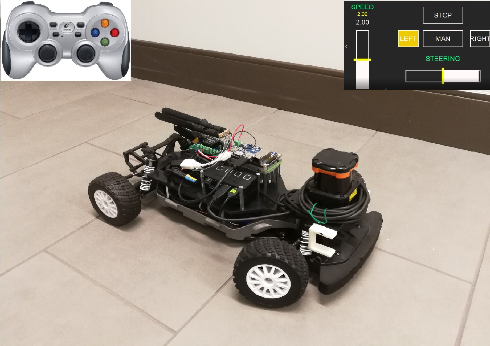
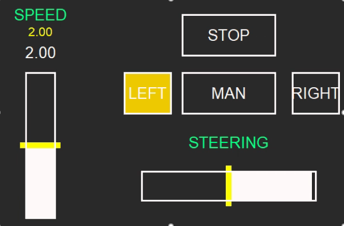

# Copilot

Please check out cpp branch, src/algorithms/wall_following for real copilot code

Copilot gives the driver maximum freedom while enhancing the safety of a high performance RC race car. It builds upon RACECAR platform (https://github.com/mit-racecar/racecar/tree/master/racecar). Autonomous driving overrides driver remote control when collision hazard is detected, and attempts to avoid collision by steering away from obstacle or brake.

## Change and progress log
### Week 1: quick and dirty with python
Understand ROS interactions and controls. Manually send ackermann steering control messages to the car. Understand existing wall following and gap finding algorithms that navigate through obstacles. Implement simple obstacle detection tests in python.

### Week 2: cpp is the way to go
Switched to C++ because of calculation within loops with primitive types is slow in python. Analyse LIDAR data to detect obstacles. Classify each lidar point detected as either safe or proximity. Design algorithm that prioritize closest obstacle on travel trajectory. TODO: insert classify as colliding diagram. Test setup: Try out different ways to activate emergency brake in front of obstacles with speed of 2 meters/sec and activation distance of 2 meters on tile floor, when driver is always giving full throttle ahead into an obstacle. 

Distance vs. Speed
Limit the maximum speed to be a function of distance to obstacle ahead. Maximum throttle corresponds to speed of distance / 1 second. Works at low speed (< 1m/s), cannot brake effectively for higher speed. Reason for ineffective braking is that wheels are still powered to go forward, but just at slower speed. The power is not enough to slow the wheels down.

Distance vs. throttle
Similar to distance vs. speed, but overrides throttle directly to zero if throttle is above distance / 1 second. Has good braking outcome, but awkward to drive near an obstacle because throttle immediately decreases to 0 if passing the threshold. 

Distance vs. Approach speed
Taking the difference of minimum obstacle distance between 2 consequtive LIDAR measurements, and dividing by time interval gives the approach rate to the obstacle. If the approach rate * 1 second is higher than the distance to obstacle, brake by setting throttle to 0. This takes skidding into consideration, so the car can have continuous braking when going into obstacle. The car is also drivable at low speed near obstacle. Driving too fast causes a dip and release in brake. The car can stop 10 cm short of the obstacle when travelling initially at 2 m/s and activating this brake algorithm at 2 meters. 

### Week 3: Side wall sequential logic
After studying algorithm on wall following and gap finding, we decide to implement our own single point obstacle avoidance algorithm. Obstacles in real life can take various forms, and our algorithm reacts to the closest colliding obstacle under the current trajectory. TODO: add diagram. First, the algorithm calculates if current trajectory is safe. If yes, then joystick signal is the only control signal to the car. If not, it checks if it can turn left or right to avoid an obstacle. This is calculated from the minimum turning radius, and position of obstacle relative to the car. If yes, it decreases the obstacle laser scan with a safety buffer to a virtual obstacle point, and aligns its front wheels with the virtual obstacle to avoid the real obstacle. If not, it engages emergency braking. The testing criterion is to drive the car at 1 m/s or 2 m/s, with driver steering always straight ahead, at 30 degrees angle into a wall, and test if steering override can prevent the car from colliding into the wall. 

After testing, we realized that the car would attempt to turn away from an obstacle for very short period of time, before it becomes too close to the obstacle and engages emergency braking. The reason is that once it turn away a little, it thinks it is safe again and follows user input of going straight. When it detects it is too close to obstacle again, the distance is already too small to turn. Our solution is to transform into sequential logic, and keep obstacle override for at least 0.2 seconds once it gets activated, so the car can turn for a longer time away from obstacle.

### Week 4: Dashboard

In order to monitor the car's status in real time, we created a sender node on the car that sends out mode and driving parameters via UDP. On a computer, we visuallize the data with a GUI written with python tkinter. The yellow lines are driver input levels, and white bars are actual control sent to car. In the above diagram, the driver is instructing 2 m/s speed, and the actual control is 2 m/s because throttle is not overridden. But the driver is not steering, and there's obstacle to the left of car, so steering is overridden with a full right to avoid obstacle. 
